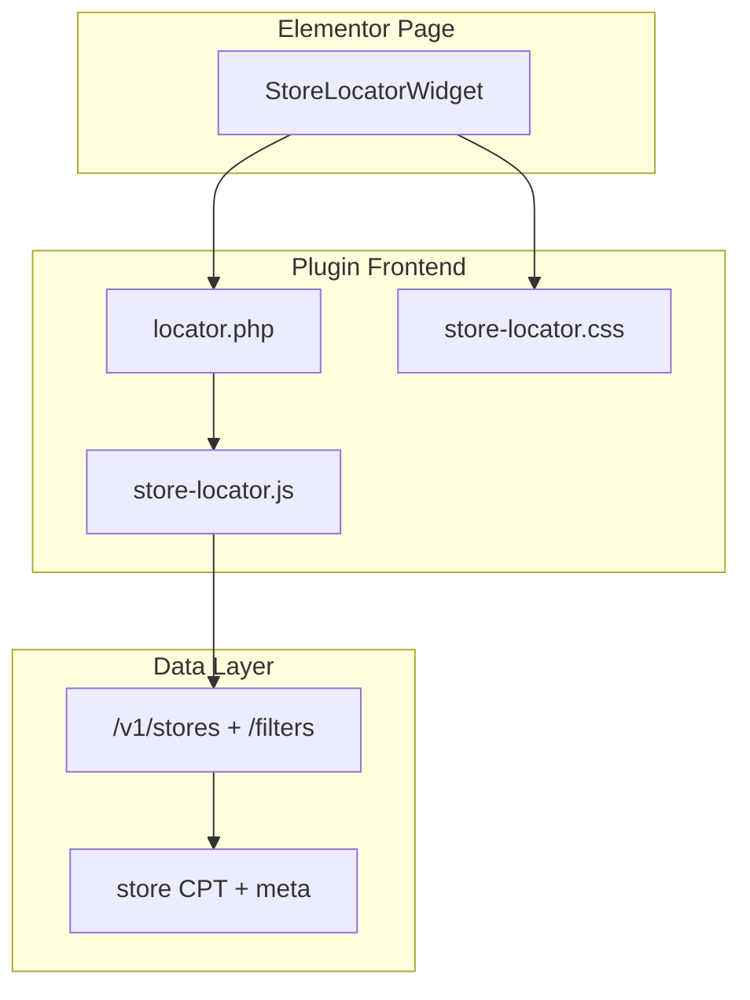

# Store Locator Elementor Widget — Figma Implementation Plan

## Context

The plugin already has a **work-in-progress Figma-aligned implementation** (uncommitted changes on top of `1dbeb1e Init`):

- Elementor widget: [`includes/Elementor/Widgets/StoreLocatorWidget.php`](includes/Elementor/Widgets/StoreLocatorWidget.php)
- Shared template: [`templates/locator.php`](templates/locator.php)
- Styles: [`assets/css/store-locator.css`](assets/css/store-locator.css)
- Frontend logic: [`assets/js/store-locator.js`](assets/js/store-locator.js)
- Brand logo helper (not yet wired): [`includes/Frontend/BrandLogos.php`](includes/Frontend/BrandLogos.php)

**Scope (confirmed):** Widget only — hero, search filters, brand pills, scrollable store list, interactive map, and mobile sticky `VIEW MAP` bar. Header, footer, and newsletter remain in the theme/other Elementor sections.



## Figma → Widget Mapping

| Figma frame | Key UI elements | Current status |
|---|---|---|
| Desktop (`26:11`) | Hero, 1118px search panel, brand pills, 682px list + map split, horizontal store cards, `OPEN MAP` CTA | ~90% — layout/CSS exist; logos, fonts, button label, polish pending |
| Mobile (`49:3198`) | Stacked filters, scrollable brand pills, vertical cards (icon+text row, actions below), sticky `VIEW MAP` | ~80% — mobile card row structure needs markup/CSS fix |
| Arabic (`45:1550`) | RTL card order, right-aligned text, `توجه للخريطة`, Tajawal font, search row reversed | ~60% — basic `[dir=rtl]` rules exist; needs deeper RTL + font |
| Spanish (`45:2173`) | Same LTR layout as English with translated strings (`ENCONTRAR TIENDA`, `ABRIR MAPA`, etc.) | Strings ready via WP i18n once `.po` files exist |

## Design Tokens (from Figma)

Apply consistently via existing CSS variables in [`.asl-locator`](assets/css/store-locator.css):

- Primary: `#AF202B` / hover `#D12027`
- Secondary (directions CTA): `#007537`
- Page background: `#F4F1EA`
- Heading: `#012027`
- Text: `#212121`, muted `#8E8E8E`, subtext `#464646`
- Borders: `#B7B7B7`, light `#DDDBD4`
- Typography: **Barlow Condensed** (EN/ES), **Tajawal** (AR/RTL)
- Radii: buttons `4px`, inputs/pills `8px`, cards `10px`, search panel `14px`

## Implementation Tasks

### 1. Wire brand assets and REST data

**Problem:** [`BrandLogos`](includes/Frontend/BrandLogos.php) exists but `ASL_Data.brandLogos` is never populated; pills and card icons fall back to text.

**Changes:**
- Extend `BrandLogos` with two catalogs:
  - `icon` SVGs (59px circle) — existing files in [`assets/images/brands/`](assets/images/brands/)
  - `full` SVGs (brand pill logos) — export from Figma and add as `aseer-time-full.svg`, `papa-kanafa-full.svg`, `farooj-full.svg`
- In [`includes/Rest/StoreController.php`](includes/Rest/StoreController.php) `get_filters()`, include `brandLogos` and `brandLogosFull` maps keyed by brand name
- In [`includes/Frontend/Assets.php`](includes/Frontend/Assets.php), pass the static catalog as fallback in `ASL_Data` so pills work before REST loads
- Update [`store-locator.js`](assets/js/store-locator.js) `renderBrandPills()` to use `brandLogosFull`, `getBrandLogo()` to use icon variant

### 2. Complete i18n for all Figma strings

**Problem:** JS references keys not defined in [`Assets.php`](includes/Frontend/Assets.php) `i18n` array (`allBrands`, `allCountries`, `resultsSummary`, `viewMap`, `openMap`, `findStore`).

**Add translatable strings:**

| Key | English default | Arabic (`.po`) | Spanish (`.po`) |
|---|---|---|---|
| `findStore` | Find Store | ابحث عن متجر | Encontrar tienda |
| `openMap` | Open Map | توجه للخريطة | Abrir mapa |
| `viewMap` | View Map | عرض الخريطة | Ver mapa |
| `allBrands` | All Brands | كل العلامات التجارية | Todas las marcas |
| `allCountries` | All Countries | كل البلدان | Todos los países |
| `resultsSummary` | `%1$s Store Found for %2$s in %3$s` | Arabic equivalent | Spanish equivalent |

- Create [`languages/aseer-store-locator.pot`](languages/) plus starter `ar` and `es_ES` `.po` files
- Handle singular/plural in `renderSummary()` (`1 Store Found` vs `3 Stores Found`)

**Note on Figma label inconsistency:** Desktop EN uses **Open Map**; mobile EN uses **Get Directions**. Implement `openMap` as default; on mobile (`<=782px`) optionally swap label via `isMobile()` in `buildCard()` to match mobile frame.

### 3. Enqueue Figma typography

In [`Assets.php`](includes/Frontend/Assets.php) `enqueue()`:
- Always load **Barlow Condensed** (400, 500, 700) from Google Fonts
- When `is_rtl()`, also load **Tajawal** (400, 500, 700) and set `--asl-font` override:

```css
[dir="rtl"] .asl-locator { --asl-font: "Tajawal", sans-serif; }
```

### 4. Polish desktop layout to match Figma

In [`store-locator.css`](assets/css/store-locator.css):
- Search panel: fixed `max-width: 1118px`, `border-radius: 14px`, desktop 3-column grid (`1fr 1fr auto`) with `24px` gap — mostly done; verify button grows equally per Figma (`flex: 1` on desktop search row)
- Brand pills container: `max-width: 420px`, centered, `justify-content: space-between` on desktop
- List panel: `682px` max column, `padding: 24px 21px 24px 56px`, `gap: 12px` between cards
- Store card: horizontal `icon | body (210px) | actions`, `padding: 18px 42px`, active/hover red border
- Update directions icon mask to Figma `directions_alt` (arrow-in-square) instead of upward arrow
- Custom scrollbar on list (`5px` pill, `#DDDBD4`) matching Arabic frame

### 5. Fix mobile card structure

Figma mobile cards use a **top row** (circular icon + text) and a **bottom row** (full-width green CTA + phone button). Current markup flattens all three into one flex column.

**Changes:**
- Refactor `buildCard()` in [`store-locator.js`](assets/js/store-locator.js) to output:

```html
<article class="asl-card">
  <div class="asl-card__top">
    <div class="asl-card__icon">…</div>
    <div class="asl-card__body">…</div>
  </div>
  <div class="asl-card__actions">…</div>
</article>
```

- Add CSS:
  - Desktop: `.asl-card__top` is `display: contents` (or flex row) so layout stays horizontal
  - Mobile (`<=782px`): `.asl-card__top` = flex row; `.asl-card__actions` = full-width row below; first card gets red border (`.is-active`)

### 6. Deepen RTL support (Arabic frame)

Extend existing `[dir="rtl"]` rules in [`store-locator.css`](assets/css/store-locator.css):
- `.asl-card__body { text-align: right; }`
- `.asl-card__hours { flex-direction: row-reverse; }` (time before clock)
- RTL card column order: actions | body | icon (Figma shows phone+CTA on visual left)
- Search row: in RTL, place Find Store button first (visual right) via `direction: rtl` on `.asl-locator__search-row` — already partially done
- Brand pills: horizontal scroll starts from right

No PHP branching needed — WordPress sets `dir="rtl"` on `<html>` for Arabic locales.

### 7. Elementor widget and asset reliability

In [`StoreLocatorWidget.php`](includes/Elementor/Widgets/StoreLocatorWidget.php):
- Keep existing Hero + Map controls (title/subtitle are how editors localize per language page in Elementor)
- Optionally add **Style** section: primary color override, map height (already exists)

In [`Assets.php`](includes/Frontend/Assets.php) `should_enqueue()`:
- Also detect `asl-store-locator` in `_elementor_data` (currently only checks `store_locator` shortcode string) — prevents edge-case unstyled pages

### 8. Verify interactive behavior

Existing JS already handles the core flows; verify after UI changes:

- Country/brand dropdowns + Find Store button filter stores
- Brand pills sync with dropdown and highlight active state (red border)
- Card click focuses map marker; first result card starts active
- Directions link uses `directions_url` from store meta (Google Maps)
- Phone button `tel:` link
- Mobile `VIEW MAP` / `LIST` toggle with map resize
- Results summary: `3 Store Found for Aseer Time in All Countries` with highlighted brand/country

## Files to Touch

| File | Changes |
|---|---|
| [`includes/Frontend/Assets.php`](includes/Frontend/Assets.php) | Fonts, i18n keys, brand logo fallback, Elementor detection |
| [`includes/Rest/StoreController.php`](includes/Rest/StoreController.php) | Return brand logo maps from `/filters` |
| [`includes/Frontend/BrandLogos.php`](includes/Frontend/BrandLogos.php) | Icon + full logo catalogs |
| [`assets/images/brands/*`](assets/images/brands/) | Add full-logo SVGs from Figma |
| [`assets/js/store-locator.js`](assets/js/store-locator.js) | Card markup, brand logos, i18n, mobile label |
| [`assets/css/store-locator.css`](assets/css/store-locator.css) | Mobile card layout, RTL, scrollbar, icons |
| [`templates/locator.php`](templates/locator.php) | Minor markup tweaks if needed (e.g. `dir` awareness) |
| [`languages/*`](languages/) | `.pot`, `ar`, `es_ES` translation files |
| [`includes/Elementor/Widgets/StoreLocatorWidget.php`](includes/Elementor/Widgets/StoreLocatorWidget.php) | No structural change; verify render path |

## Test Plan

1. **Elementor editor:** Drag "Store Locator" widget from category `aseer-store-locator`; confirm live preview loads map + styles in iframe
2. **Desktop EN:** Hero, search panel, brand pills with logos, side-by-side list/map, `Open Map` CTA, results summary highlighting
3. **Mobile (≤782px):** Stacked filters, horizontal brand scroll, card layout with bottom actions, sticky `VIEW MAP` toggles to map
4. **Arabic (RTL locale):** Tajawal font, mirrored layout, translated strings, RTL hours row
5. **Spanish locale:** Translated filter/button labels, LTR layout unchanged
6. **Data:** Import [`stores-example.csv`](stores-example.csv); verify brand icons resolve for Aseer Time, Papa Kanafa, Farooj
7. **Regression:** `[store_locator]` shortcode still renders identically (shared template)

## Out of Scope

- Header, footer, newsletter (theme/other Elementor widgets)
- Build pipeline (no webpack/vite — keep plain CSS/JS)
- New map provider features beyond existing Leaflet/Google settings
